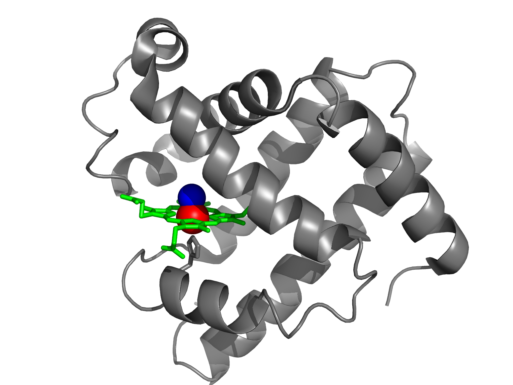
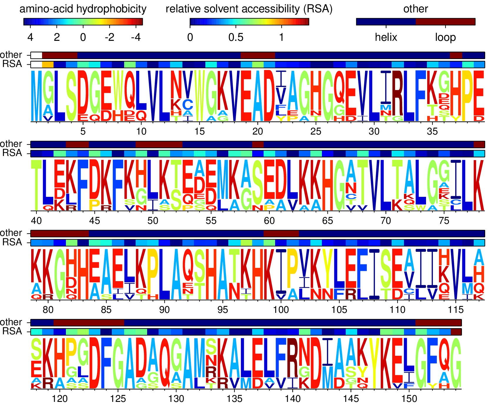
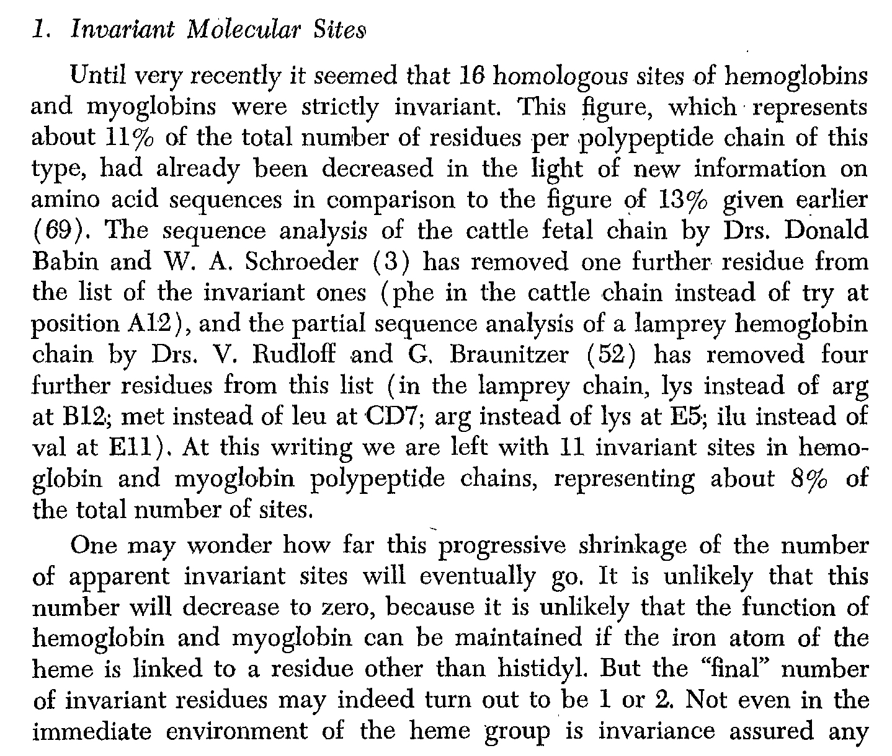
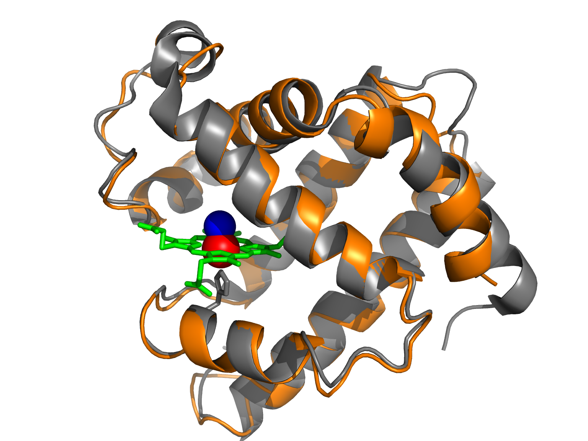

===============================================
Lecture 1 
===============================================

* Genome Sciences 541, `Jesse Bloom`_

* These slides are at http://jbloom.github.io/GenomeSciences541/lecture_1.html

* Reading for this lecture is :download:`Zuckerkandl and Pauling (1965) <readings/Zuckerkandl_and_Pauling-1965.pdf>`.
  Read pages 97-114 and 147-152 carefully,
  skim pages 115-146,
  feel free to skip pages 153-end.

* The homework for this lecture is at `homework 1`_.

Lecture 1: the evolution of protein-coding genes
==================================================
* :download:`Zuckerkandl and Pauling (1965) <readings/Zuckerkandl_and_Pauling-1965.pdf>`: one of the first molecular studies of protein evolution

* Structure imposes many constraints

* Very hard to quantitatively understand these constraints

* Sequence divergence :math:`\ne` Functional divergence

* A molecular clock?

Genes evolve at the level of DNA (or RNA for some viruses)
~~~~~~~~~~~~~~~~~~~~~~~~~~~~~~~~~~~~~~~~~~~~~~~~~~~~~~~~~~~~
We routinely abstract the complex molecule DNA to strings of letters with little loss of relevant information::

    atg gtg ctc agc gag gga gaa tgg cag ttg gtt ctg cac gtc ...

*It has not escaped our notice that the specific pairing we have postulated immediately suggests a possible copying mechanism for the genetic material.* -- `Watson and Crick (1953)`_

*The translation from nucleic acid to protein proceeds in a sequential fashion according to a systematic code with relatively simple rules.* -- `Nirenberg (1968)`_

But most selection is on the protein
~~~~~~~~~~~~~~~~~~~~~~~~~~~~~~~~~~~~~~~~~~~~~
The properties of proteins are **not** easily abstracted. 

Proteins are linear polymers encoded by DNA::

    atg gtg ctc agc gag gga gaa tgg cag ttg gtt ctg cac gtc ...
    M   V   L   S   E   G   E   W   Q   L   V   L   H   V   ...

Proteins derive their relevant properties from their three-dimensional structures.

Properties of proteins are not easily abstracted
~~~~~~~~~~~~~~~~~~~~~~~~~~~~~~~~~~~~~~~~~~~~~~~~~~~

   `PyMol analysis of myoglobin`_

   *Perhaps the most remarkable features of the molecule are its complexity and its lack of symmetry. The arrangement seems to be almost totally lacking in the kind of regularities which one instinctively anticipates, and it is more complicated than has been predicated by any theory of protein structure.* -- `Kendrew et al (1958)`_

Context for reading Zuckerkandl and Pauling (1965)
~~~~~~~~~~~~~~~~~~~~~~~~~~~~~~~~~~~~~~~~~~~~~~~~~~~~

.. figure:: images/Zuckerkandl_and_Pauling-1965.png
   :width: 90%
   :align: center

   :download:`Zuckerkandl and Pauling (1965) <readings/Zuckerkandl_and_Pauling-1965.pdf>`

They knew the structure of sperm whale myoglobin
~~~~~~~~~~~~~~~~~~~~~~~~~~~~~~~~~~~~~~~~~~~~~~~~~~~

   `PyMol analysis of myoglobin`_

   Structure had been determined by `Kendrew et al (1958)`_

They knew that single mutations could potentially have large biological consequences
~~~~~~~~~~~~~~~~~~~~~~~~~~~~~~~~~~~~~~~~~~~~~~~~~~~~~~~~~~~~~~~~~~~~~~~~~~~~~~~~~~~~~
::

    MVHLTPEEKSAVT...
    MVHLTPvEKSAVT...

`"Sickle Cell Anemia, a Molecular Disease" (Pauling et al, 1949)`_

`"A Specific Chemical Difference between Globins of Normal and Sickle-cell Anemia Hemoglobins" (Ingram, 1956)`_

They knew the sequences of a variety of homologous globins
~~~~~~~~~~~~~~~~~~~~~~~~~~~~~~~~~~~~~~~~~~~~~~~~~~~~~~~~~~~~~~~~~
* sperm whale myoglobin

* human myoglobin

* human hemoglobin :math:`\alpha`, :math:`\beta`, :math:`\gamma`, and :math:`\delta` chains

* horse hemoglobin :math:`\alpha` and :math:`\beta` chains

* cattle hemoglobin :math:`\alpha` and :math:`\beta` chains

* cattle fetal hemoglobin chain

* pig hemoglobin :math:`\alpha` and :math:`\beta` chains

* gorilla :math:`\alpha` and :math:`\beta` chains

* carp hemoglobin :math:`\alpha` chain

* lamprey hemoglobin chain

Analysis of myoglobin homologs
~~~~~~~~~~~~~~~~~~~~~~~~~~~~~~~
We will perform an analysis similar to that of Zuckerkandl and Pauling, and look at some of the conclusions that they draw.

Myoglobin homologs
~~~~~~~~~~~~~~~~~~~

.. include:: myoglobin_homologs/aligned_proteins.fasta
   :literal: 

Sequences at `Analysis of myoglobin homologs`_

Site variability among myoglobin homologs
~~~~~~~~~~~~~~~~~~~~~~~~~~~~~~~~~~~~~~~~~~~~

   Code /data to produce this figure at `Analysis of myoglobin homologs`_

Very little sequence is strictly conserved
~~~~~~~~~~~~~~~~~~~~~~~~~~~~~~~~~~~~~~~~~~~~~

   :download:`Zuckerkandl and Pauling (1965) <readings/Zuckerkandl_and_Pauling-1965.pdf>`

Relatively few insertions and deletions
~~~~~~~~~~~~~~~~~~~~~~~~~~~~~~~~~~~~~~~~~~~~~
*Deletions or additions of one to several amino acid residues are expected to be eliminated by natural selection in a high proportion of cases. Those that are preserved should be mostly found at either end of a chain, at the end of helices, in short helices, or in nonhelical regions, notably in loops that may be shortened or lengthened without  affecting the steric relationships in the rest of the molecule, A deletion or addition in the middle of a long helix would result in so many simultaneous alterations in side-chain interactions that it is highly unlikely that the tertiary structure and the function of the molecule could survive such an event. The deletions or additions found in hemoglobin and myoglobin chains are compatible with these generalities.* 

:download:`Zuckerkandl and Pauling (1965) <readings/Zuckerkandl_and_Pauling-1965.pdf>`

Structure is highly conserved
~~~~~~~~~~~~~~~~~~~~~~~~~~~~~~~~
.. figure:: images/structural_conservation.png
   :width: 90%
   :align: center

   :download:`Zuckerkandl and Pauling (1965) <readings/Zuckerkandl_and_Pauling-1965.pdf>`

This observation has stood the test of time. In fact, sequences with as little as 30-35% identity generally have
very similar structures. See `Chothia and Lesk (1984) <http://www.ncbi.nlm.nih.gov/pmc/articles/PMC1166865/?page=1>`_ and `Sander and Schneider (1991) <http://cbio.mskcc.org/publications/papers/sander/038.pdf>`_.

Structure is highly conserved
~~~~~~~~~~~~~~~~~~~~~~~~~~~~~~~~

   `PyMol analysis of myoglobin`_

   Structural alignment of sperm whale (gray) and yellowfin tuna (orange) myoglobins. These proteins are only 57% identical.

Different proteins evolve at different rates
~~~~~~~~~~~~~~~~~~~~~~~~~~~~~~~~~~~~~~~~~~~~~~~
.. figure:: images/cytochrome_C.png
   :width: 100%
   :align: center

   :download:`Zuckerkandl and Pauling (1965) <readings/Zuckerkandl_and_Pauling-1965.pdf>`

Zuckerkandl and Pauling propose a molecular clock 
~~~~~~~~~~~~~~~~~~~~~~~~~~~~~~~~~~~~~~~~~~~~~~~~~~~~~
.. figure:: images/conclusions_1.png
   :width: 100%
   :align: center

   :download:`Zuckerkandl and Pauling (1965) <readings/Zuckerkandl_and_Pauling-1965.pdf>`

Zuckerkandl and Pauling propose a molecular clock 
~~~~~~~~~~~~~~~~~~~~~~~~~~~~~~~~~~~~~~~~~~~~~~~~~~~~~
.. figure:: images/conclusions_2.png
   :width: 100%
   :align: center

   :download:`Zuckerkandl and Pauling (1965) <readings/Zuckerkandl_and_Pauling-1965.pdf>`

Important implications
~~~~~~~~~~~~~~~~~~~~~~~~
* The extent of sequence change can be used to reconstruct evolutionary relationships (*molecular phylogenetics*)

* However, the constant background sequence change can make it difficult to pinpoint biologically important changes:

    - *Positive selection* : for instance, take a look at `nextflu <http://nextflu.org/H3N2/>`_

    - *Disease-causing mutations* 

Quantitative analyses of the molecular evolution of protein-coding genes
~~~~~~~~~~~~~~~~~~~~~~~~~~~~~~~~~~~~~~~~~~~~~~~~~~~~~~~~~~~~~~~~~~~~~~~~~~~~~~~~~~~~~~~~
* Today we will work on forming a conceptual view of the process molecular evolution

* In the homework, you will simulate this process 

* In the next three lectures, we will discuss approaches to quantitatively analyze this type of data from the perspective of molecular phylogenetics

* There is a constant tension between *biochemical realism* and *analytical tractability*: many of the assumptions are made not because we think they are strictly true, but because we have to make them to do the analysis.

The evolution studied in molecular phylogenetics is due to both mutation and selection
~~~~~~~~~~~~~~~~~~~~~~~~~~~~~~~~~~~~~~~~~~~~~~~~~~~~~~~~~~~~~~~~~~~~~~~~~~~~~~~~~~~~~~~~
::

    atg gtg ctc agc gag gga gaa tgg cag ttg gtt ctg cTc gtc ...
    atg gtg ctc agc gag gga gaa tgA cag ttg gtt ctg cac gtc ...
    atg gtg ctc agc Cag gga gaa tgg cag ttg gtt ctg cac gtc ...

::

    atg gtg Atc agc gag gga gaa tgg cag ttg gtt ctg cac gtc ...
    atg gtg ctc agc Cag gga gaa tgg cTg ttg gtt ctg cac gtc ...
    atg gtg ctc agc Cag gga gaa tgg cag ttg gtA ctg cac gtc ...

::

    atg gtA ctc agc Cag gga gaa tgg cag ttg gtt ctg cac gtc ...
    atg gtg ctc agc Cag gga gaa tgg cTg ttg gtt ctg Aac gtc ...
    atg gtg ctc agc Cag gga gaa tgg cTg ttg gtA ctg cac gtc ...

::

    atg atg cAc agc Cag gga gaa tgg cTg ttg gtt ctg cac gtc ...
    atg gtg ctc agc Cag gga gaa tgg cTg ttg gtt ctg Aac gtc ...
    atg gtg ctc agc Cag gga gaa tgg cTg ttg gtA ctg cac gtc ...

We will ignore the intra-population polymorphism
~~~~~~~~~~~~~~~~~~~~~~~~~~~~~~~~~~~~~~~~~~~~~~~~~~~~~~~~
::

    atg gtg ctc agc cag gga gaa tgg cag ttg gtt ctg cac gtc ...

::

    atg gtg ctc agc Cag gga gaa tgg cag ttg gtt ctg cac gtc ...

::

    atg gtg ctc agc Cag gga gaa tgg cTg ttg gtt ctg cac gtc ...

::

    atg gtg ctc agc Cag gga gaa tgg cTg ttg gta ctg cac gtc ...

We ignore within-species variation, and treat the evolving populations as a single clonal sequence. This assumption may sometimes be problematic, as the frequency of an allele in a population is not necessarily equal to its probability of ultimately fixing. We are not going to worry about this problem here...

We assume that selection is on the protein sequence
~~~~~~~~~~~~~~~~~~~~~~~~~~~~~~~~~~~~~~~~~~~~~~~~~~~~~~~~~~~~~~~~~~~~~~~
This leads to the distinction between *synonymous* mutations::

    atg gtg ctc agc gag gga gaa tgg cag ttg gtt ctg cac gtc ...
    M   V   L   S   E   G   E   W   Q   L   V   L   H   V   ...
    atg gtg ctc agc gag ggC gaa tgg cag ttg gtt ctg cac gtc ...
    M   V   L   S   E   G   E   W   Q   L   V   L   H   V   ...

and *nonsynonymous* mutations::

    atg gtg ctc agc gag gga gaa tgg cag ttg gtt ctg cac gtc ...
    M   V   L   S   E   G   E   W   Q   L   V   L   H   V   ...
    atg gtg ctc agc gag Cga gaa tgg cag ttg gtt ctg cac gtc ...
    M   V   L   S   E   R   E   W   Q   L   V   L   H   V   ...

What would you expect about their relative rates of fixation?

We assume that genes can be aligned, and ignore gaps
~~~~~~~~~~~~~~~~~~~~~~~~~~~~~~~~~~~~~~~~~~~~~~~~~~~~~~
::

    atg gtg ctc agc cag gga gaa tgg cag ttg gtt ctg cac gtc ...

::

    atg gtg ctc agc Cag gga gaa tgg cag ttg gtt ctg cac gtc ...

::

    atg gtg ctc agc Cag gga gaa tgg cTg ttg --- ctg cac gtc ...

The results are therefore dependent on the alignment. We'd get a different evolutionary scenario if we aligned the last homolog as::

    atg gtg ctc agc Cag gga gaa tgg cTg ttg CtG cAC --- gtc ...

We envision mutation as identical across sites
~~~~~~~~~~~~~~~~~~~~~~~~~~~~~~~~~~~~~~~~~~~~~~~~
* Each nucleotide mutation is equally likely (Jukes-Cantor model)

* Some nucleotide mutations are likely than others

* On clear observation is that *transition* mutations tend to be more likely than *transversion* mutations

    - *transitions*: purine to purine (:math:`A \leftrightarrow G`), pyrimidine to pyrimidine (:math:`C \leftrightarrow T`)

    - *transversions*: purine to pyrimidine or pyrimidine to purine (:math:`A\leftrightarrow C`, :math:`A\leftrightarrow T`, :math:`G\leftrightarrow T`, :math:`G\leftrightarrow C`)

    - The symbol :math:`\kappa` is often used to denote the relative rate of given *transition* mutation to a given *transversion* mutation. A typical value might be :math:`\kappa \approx 4` although this varies among organisms.

We know that selection is **not** identical across sites
~~~~~~~~~~~~~~~~~~~~~~~~~~~~~~~~~~~~~~~~~~~~~~~~~~~~~~~~~~~

   Code /data to produce this figure at `Analysis of myoglobin homologs`_

We know that selection is **not** identical across sites
~~~~~~~~~~~~~~~~~~~~~~~~~~~~~~~~~~~~~~~~~~~~~~~~~~~~~~~~~~~
However, as we will see in future lectures, we often are forced to assume that it is identical (or nearly so) across sites.

Simulating this process (your homework)
~~~~~~~~~~~~~~~~~~~~~~~~~~~~~~~~~~~~~~~~~~
In `homework 1`_, you will simulate the evolution of myoglobin.

You will start with the coding sequence for sperm whale myoglobin, and introduce random nucleotide mutations. Mutations that alter the protein sequence will be subjected to purifying selection as modeled by the `FoldX energy function`_.

The output of these simulations will be set of simulated evolved sequences which we will use for the inferences in the remaining lectures.

Inference
~~~~~~~~~~~~~
We can understand the inferences that we will try to make from :download:`Zuckerkandl and Pauling (1965) <readings/Zuckerkandl_and_Pauling-1965.pdf>`:

*There may thus exist a molecular evolutionary clock.*

Specifically, we want to estimate how many substitutions occurred (steps in your homework) from the observed sequence divergence.

:download:`Zuckerkandl and Pauling (1965) <readings/Zuckerkandl_and_Pauling-1965.pdf>` present a very crude way to make these inferences. Today we'll discuss their approach; next lecture we'll start doing better.

Inference
~~~~~~~~~~

.. figure:: images/inference.png
   :align: center
   :width: 100%

   :download:`Zuckerkandl and Pauling (1965) <readings/Zuckerkandl_and_Pauling-1965.pdf>` 

Inference
~~~~~~~~~~

.. figure:: images/inference_plot.png
   :align: center
   :width: 80%

   :download:`Zuckerkandl and Pauling (1965) <readings/Zuckerkandl_and_Pauling-1965.pdf>` 

.. include:: weblinks.txt
